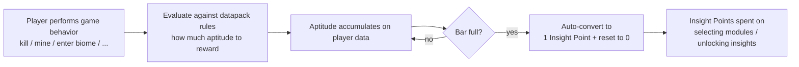

# Aptitude & Insight Point

Aptitude is the player's **experience reservoir**, and Insight Points are the **spendable skill points**. Together they form Epiphany's resource system.

::: info
This page is aimed at datapack authors, explaining aptitude source configuration and the Insight Point acquisition formula. **For registering new aptitude behaviors (third-party mod extensions), see [Registering a New Aptitude Source](Register%20New%20Aptitude%20Source.md).**
:::

## Core Flow



## File Location

Aptitude mappings are defined as per-behavior datapack JSON files:

```
data/<namespace>/epiphany/aptitude/<behavior>.json
```

- Each file represents **one behavior type** (e.g., `kill_entity`, `mine_block`, `experience_level_up`)
- **Behavior ID = `<namespace>:<filename>`** (parent directory paths are not included)
  - `data/mymod/epiphany/aptitude/fishing.json` —`mymod:fishing`
- **Behavior IDs are strictly tied to listener requirements** — the 13 built-in behaviors have fixed filenames (see table below). Other IDs only take effect when a third-party mod registers a corresponding listener.

## Full Example

```jsonc
{
    "default": 3,                              // optional, defaults to 0
    "specials": [                              // optional, defaults to empty
        {
            "target": "minecraft:zombie",      // required; plain id or "#tag"
            "reward": 5,                       // optional; defaults to `default`
            "first_reward": 1000               // optional; granted once per player (persisted)
        },
        {
            "target": "minecraft:wither",
            "reward": 100,
            "first_reward": 500
        }
    ],
    "exclude": [                               // optional, defaults to empty
        "#epiphany:friendly",                  // if matched, skip this grant entirely
        "minecraft:villager"                   // plain id or "#tag"
    ]
}
```

**Minimal form** (only a default reward):

```jsonc
{ "default": 2 }   // e.g., experience_level_up.json —+2 aptitude per level-up
```

## Field Reference

### `default` (optional)

- Type: `long`
- Default: `0`
- The aptitude granted when the trigger target is **neither in `specials` nor in `exclude`**

::: tip
If `default = 0` and no specials match, the behavior **grants no aptitude at all**.
:::

### `specials` (optional)

- Type: list of `SpecialEntry`
- Default: empty
- Per-target reward rules that **override** the `default`

Each `SpecialEntry` has three fields:

| Field | Type | Required | Description |
|-------|------|:--------:|-------------|
| `target` | String | —| Target reference — plain id (`"minecraft:zombie"`) or tag reference (`"#minecraft:undead"`) |
| `reward` | long (optional) | | Aptitude reward for this target; **falls back to `default`** when omitted |
| `first_reward` | long (optional) | | Extra reward **granted only once per player**, stacked on top of `reward`; tracking state is persisted in player data |

::: tip `first_reward` Usage
`first_reward` is an extra bonus for "the first time a player does something." Typical use cases:
- First boss kill: `{ "target": "minecraft:wither", "reward": 100, "first_reward": 500 }` — the first wither kill grants 600 (100 + 500); subsequent kills grant only 100
- First time entering a rare biome: same logic

Each player's "claimed list" is saved in their player data and persists across death, respawn, and dimension changes.
:::

### `exclude` (optional)

- Type: list of String
- Default: empty
- **Blacklist**: if matched, the grant is **completely skipped** (bypasses both `specials` and `default` evaluation)
- Each entry is the same format as `target` — plain id or `"#tag"`

::: warning `exclude` has "short-circuit" semantics
`exclude` is evaluated **before** `specials`: if any exclude entry matches the target, the entire grant **immediately terminates**, even if a special also matches that target. In other words, `exclude` has the highest priority.

Use case: "no aptitude for any friendly mobs" —`"exclude": ["#epiphany:friendly"]` — no need to list each one individually.
:::

## Tags & Registry Relationship

Both `specials[].target` and `exclude[]` support the `"#tag"` format (standard Minecraft tag references). However, to correctly resolve a tag, the system needs to know which registry the target belongs to:

- **Built-in behaviors have fixed registries** (see table below) — datapack authors don't need to worry about this; just use the correct tag namespace
- **If a behavior has no natural registry** (e.g., `experience_level_up`), the `"#tag"` format **never matches** and will fall back to `default` or grant nothing

## Built-in Behaviors (13 types)

Below are the 13 behaviors that Epiphany provides listeners for natively. The filename in your datapack must match the ID below for the listener to find your configuration.

### General Behaviors (Vanilla Events)

| Behavior ID | Trigger | Target Format | Registry | `#tag` Support |
|-------------|---------|---------------|----------|:--------------:|
| `epiphany:kill_entity` | Player kills an entity | entity type id (`minecraft:zombie`) | `ENTITY_TYPE` | —|
| `epiphany:mine_block` | Player mines a block | block id (`minecraft:diamond_ore`) | `BLOCK` | —|
| `epiphany:advancement_earn` | Player earns an advancement | advancement id (`minecraft:end/kill_dragon`) | —| —|
| `epiphany:experience_level_up` | Player gains an experience level | none (placeholder) | —| —|
| `epiphany:enter_dimension` | Player changes dimension | dimension id (`minecraft:the_nether`) | —| —|

::: tip `experience_level_up` only uses `default`
`experience_level_up` has no natural target (each level-up is just a number change). The listener calls `grant` once per level, using a **placeholder target**. So datapacks only need to write:
```jsonc
{ "default": 2 }
```
`specials` and `exclude` are **ineffective** (the target is always `epiphany:_`).
:::

### State-Tracking Behaviors (Require Persistent Comparison)

| Behavior ID | Trigger | Target Format | Registry | `#tag` Support |
|-------------|---------|---------------|----------|:--------------:|
| `epiphany:enter_biome` | Player's current biome changes | biome id | `BIOME` (from level registry) | —|
| `epiphany:enter_structure` | Player's set of containing structures changes | structure id or `epiphany:none` (not in any structure) | `STRUCTURE` (from level registry) | —|

::: info Special Target for `enter_structure`
When the player is **not inside any structure**, the listener sends `epiphany:none` as the target (a sentinel value). You can use this to implement "exploration reward only while inside structures" logic:

```jsonc
{
    "default": 1,
    "specials": [
        { "target": "epiphany:none", "reward": 0 }  // no aptitude when not in a structure
    ]
}
```
:::

### Epiphany Internal Behaviors

| Behavior ID | Trigger | Target Format |
|-------------|---------|---------------|
| `epiphany:module_selected` | Module selected (`ModuleSelectedEvent`) | module id |
| `epiphany:module_completed` | Module completed (`ModuleCompletedEvent`) | module id |
| `epiphany:insight_selected` | Insight unlocked (`InsightSelectedEvent`) | insight id |
| `epiphany:epiphany_selected` | Epiphany activated (`EpiphanySelectedEvent`) | epiphany id |

### FTB Quests Integration (Soft Dependency)

| Behavior ID | Trigger | Target Format | Notes |
|-------------|---------|---------------|-------|
| `epiphany:ftbq_quest_complete` | FTB Quests quest completed | FTBQ quest hex string id | Requires FTB Quests installed |
| `epiphany:ftbq_chapter_complete` | FTB Quests chapter completed | FTBQ chapter hex string id | Same as above |

When FTB Quests is not loaded, these two listeners **will not register** (soft dependency isolation), and the corresponding JSONs are simply ignored without causing crashes.

## Configuration

The following options are in `config/epiphany-common.toml` and affect all aptitude acquisition:

| Config Option | Default | Description |
|---------------|:-------:|-------------|
| `aptitudeGainMultiplier` | `1.0` | **Global multiplier** applied to all aptitude granted by datapack behaviors; `0.0` effectively disables datapack sources, `2.0` doubles everything |
| `baseAptitudeCap` | `10` | Base aptitude required for the first Insight Point |
| `aptitudeCapGrowth` | `1` | Additional aptitude required for each subsequent Insight Point |

::: tip Use the multiplier for balancing
You don't need to adjust individual JSON values. If the overall pacing is too fast or too slow, simply change `aptitudeGainMultiplier` to globally scale — without affecting the relative proportions within your datapack.
:::

## Aptitude —Insight Point Formula

When the aptitude bar is full, it auto-converts to 1 Insight Point and resets to zero. **The required aptitude increases with the total number of Insight Points earned:**

$$
\text{Required} = \text{baseAptitudeCap} + (\text{totalSpent} + \text{insightPoints}) \times \text{aptitudeCapGrowth}
$$

Where:
- `totalSpent` = total Insight Points the player has historically spent
- `insightPoints` = currently available unspent Insight Points
- Their sum = **total Insight Points ever earned** = the current tier

### Default Formula Examples (`baseAptitudeCap=10`, `aptitudeCapGrowth=1`)

| Total Insight Points Earned | Aptitude Needed for Next Point |
|:---:|:---:|
| 0 | 10 |
| 1 | 11 |
| 2 | 12 |
| 5 | 15 |
| 10 | 20 |
| 50 | 60 |

Adjust the two config parameters to control pacing:
- Increase `baseAptitudeCap` —**slower early game** (stretches the beginning)
- Increase `aptitudeCapGrowth` —**steeper late game** (widens the depth)
- Increase both — massive aptitude requirements throughout

## Where Insight Points Go

Insight Points leaving the aptitude system have two spending destinations, both handled uniformly:

| Spending Scenario | Amount | Affected Fields |
|-------------------|--------|-----------------|
| Selecting a module | `Config.moduleSelectCost` (default 1) | `insightPoints--`, `totalInsightPointsSpent++` |
| Unlocking an insight | Per-insight `cost` field (default 1) | Same as above |

## Next Steps

- How players earn and spend Insight Points —[Mechanics](../Players/Gameplay.md)
- Granting aptitude from Java code —[Manager API](Manager%20API.md#aptitudemanager) / [AptitudeSourceManager](Manager%20API.md#aptitudesourcemanager--aptitudesourceresolver)
- Registering new aptitude behaviors (third-party extensions) —[Registering a New Aptitude Source](Register%20New%20Aptitude%20Source.md)
