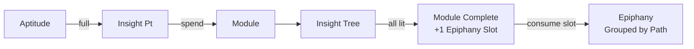
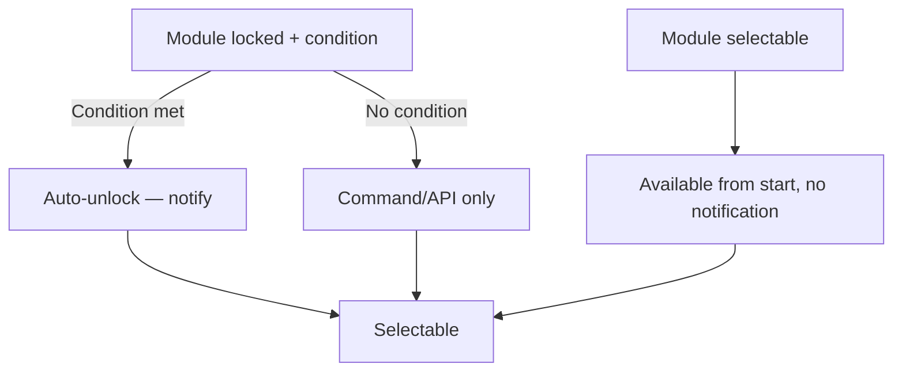
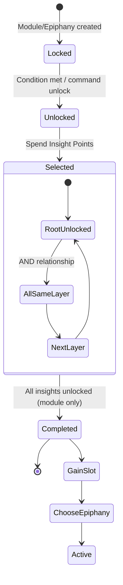

# Core Gameplay

::: info
This page explains the six core concepts of **Epiphany** in depth from a **player's perspective**. For developer-oriented field definitions, see the [For Developers](../Developers/Quick%20Start.md) section.
:::

## Concept Overview

| Concept | Description |
|---------|-------------|
| **Module** | An independent, self-contained skill tree unit |
| **Insight** | Incremental upgrade nodes within a module |
| **Epiphany** | A qualitative ability reward earned by completing a module |
| **Path** | A categorization label for epiphanies |
| **Aptitude** | An experience reservoir — when full, it converts into Insight Points |
| **Insight Point** | The "skill points" used for spending |

## 1. Aptitude

Aptitude is the player's **experience reservoir**.

### 1.1 Acquisition

Aptitude acquisition rules are **entirely defined by datapacks**. Modpack authors decide via JSON:

- Which behaviors reward aptitude (13 built-in types: slaying, mining, entering biomes, earning advancements, etc.)
- Reward values for each target
- Whether each player gets a bonus for their first kill / first completion
- Which targets grant no reward (exclusion list)
- A global reward multiplier (`aptitudeGainMultiplier` config option)

::: tip
Epiphany itself does not prescribe any behavior rewards -- whether you earn aptitude from mining or slaying depends on the modpack.
:::

### 1.2 Level-Up Formula

When the aptitude bar is full, it automatically converts into 1 Insight Point and resets to zero. **The aptitude required increases with the total number of Insight Points earned:**

$$
\text{Required} = \text{baseAptitudeCap} + (\text{totalSpent} + \text{insightPoints}) \times \text{aptitudeCapGrowth}
$$

**Example with defaults** (`baseAptitudeCap = 10`, `aptitudeCapGrowth = 1`):

| Total Insight Points Earned | Aptitude Needed for Next Point |
|:---:|:---:|
| 0 | 10 |
| 1 | 11 |
| 2 | 12 |
| 5 | 15 |
| 10 | 20 |

Both parameters are adjustable in the config, allowing modpacks to control early/late-game pacing.

### 1.3 Characteristics

- Aptitude has a **cap** (controlled by config) — it won't accumulate indefinitely
- Aptitude is **retained on death**
- Aptitude does **not partially convert** — you must reach the full cap to earn 1 complete Insight Point
- Insight Points have **no upper limit** and can stack indefinitely

## 2. Insight Points

Insight Points are the "skill points" used for spending.

### 2.1 Sources

| Source | Description |
|--------|-------------|
| Aptitude bar full | Automatic +1 |
| Commands | `/epiphany insight points add <player> <amount>` |
| Reward chain | Certain reward types in datapacks can directly grant Insight Points |

### 2.2 Spending

| Scenario | Default Cost | Notes |
|----------|:---:|-------|
| Selecting a module | `moduleSelectCost = 1` | Uniform across all modules; cannot be set per-module |
| Unlocking an insight | Insight JSON `cost` field (default 1) | Each insight can set its own cost |

### 2.3 Characteristics

- No upper limit
- Retained on death
- Cannot be actively discarded or traded by the player

## 3. Modules

A module is an **independent, self-contained** skill tree unit.

### 3.1 Initial State

Modules have **two possible initial states** that determine their starting visibility and selectability:

| State | Meaning |
|------|---------|
| **`locked`** | Player cannot see or select it initially. If the module has a `condition`, it auto-unlocks when the condition is met, with a notification. If **no** condition is defined, it can only be unlocked via admin command / API. |
| **`selectable`** | Player can see and select it from the start. These modules typically have no condition. |

### 3.2 Unlock Flow

### 3.3 Selection

- Selecting a module uniformly costs `moduleSelectCost` Insight Points (default 1)
- There is a cap on simultaneous selected modules: `maxSelectedModules` (default 8)
- Upon selection, the module's `on_select_reward` takes effect immediately; rewards can be items, attributes, commands, effects, etc.

::: tip
Module selection is a **Pre-event cancellable** timing point. Modpack authors can intercept via KubeJS.
:::

### 3.4 Completion

When **all insights** within a module are unlocked, the module is automatically **completed**:

1. Triggers `on_complete_reward` (if defined)
2. **+1 Epiphany Slot**
3. Post notification event

Module completion itself cannot be manually cancelled — it triggers as soon as all insights are lit. However, the Pre event allows third-party interception to **leave it pending re-trigger** (in which case no slot is granted, no reward is given, and the module stays incomplete).

### 3.5 Reset

- Players **cannot undo** a module selection
- Admins can use:
  - `/epiphany module reset <player> <moduleId>` — reset a single module (back to unselected)
  - `/epiphany reset select <player>` — clear all selections (refund Insight Points)
  - `/epiphany reset all <player>` — full reset (aptitude also cleared)

## 4. Insights & Insight Tree

Insights are **incremental** upgrade nodes within a module.

### 4.1 Tree Structure (depth)

A module defines its insight tree via an `insights` list in JSON, with each entry carrying a **`depth`** field:

- **`depth = 0`** — root nodes (topmost layer)
- **`depth = N`** — its parent is the most recent preceding insight at `depth = N-1` in the array
- **Multiple insights at the same depth** —**AND relationship**: you must unlock **all of them** before the next layer unlocks

### 4.2 Unlock Prerequisites

To unlock an insight, you must **simultaneously satisfy**:

1. The owning module is **selected**
2. All **mandatory ancestor** insights at the same and shallower depths are already unlocked
3. Enough Insight Points to cover the `cost`

### 4.3 Characteristics

- Insight `cost` in JSON defaults to 1 and can be set independently per insight
- Insight rewards tend toward quantitative: minor stat boosts, effects, items, etc.
- Unlocking is **irreversible** on the player side — only admin commands (`/epiphany insight reset`) can undo
- If an insight reward is "persistent" (e.g., attribute modifier), it is automatically **reapplied** after death / dimension change

## 5. Epiphanies

Epiphanies are **qualitative** ability rewards.

### 5.1 Unlock & Selection

- Epiphanies exist in a **global pool**, decoupled from specific modules
- Epiphanies also have `locked` / `selectable` initial states, with the same semantics as modules
- Players must spend an **Epiphany Slot** to activate an epiphany

### 5.2 Epiphany Slots

| Rule | Description |
|------|-------------|
| Acquisition | +1 slot per completed module |
| Cap | `maxEpiphanySlots` (default 8) |
| Usage | 1 slot = 1 active epiphany |
| Release | Resetting an epiphany frees up its slot |

::: warning
If you complete modules beyond the slot cap, they still count as "completed" but **no extra usable slots are granted**. You'll need to reset old epiphanies to free up space.
:::

### 5.3 Path Grouping

- An epiphany can specify a `path` field to assign it to a **Path**, which is used for **pagination/grouping** in the UI
- The relationship is **one-way**: Epiphany → Path; a Path does not hold a list of epiphanies
- Epiphanies without a `path` fall into the **default group**
- Paths are purely for display and do not affect game logic

### 5.4 Characteristics

- Epiphany effects lean toward qualitative: new mechanics, powerful passives, rule changes
- Persistent epiphany rewards are automatically reapplied after death / dimension change
- Epiphanies cannot be individually undone by the player — only `/epiphany epiphany reset <player> <epiphanyId>` works

## 6. Paths

A Path is a **categorization label** for epiphanies with no gameplay effect of its own.

- Optional: epiphanies don't have to specify one
- One-way: Epiphany → Path
- UI: epiphanies are displayed grouped by Path
- Default group: epiphanies without a `path` field are assigned here automatically

## 7. Events & Notifications

### 7.1 Player-Visible Notifications

Epiphany sends **chat messages + sound effects** at the following events (temporary solution; planned to become Toasts in the future):

| Notification Toggle | When It Fires |
|---------------------|---------------|
| `notifyInsightPoints` | When Insight Points are gained (bar fill, command grant, reward grant) |
| `notifyModuleUnlock` | When a `locked` module with a condition auto-unlocks. **`selectable` modules do not notify.** |
| `notifyEpiphanyUnlock` | When a `locked` epiphany with a condition auto-unlocks. **`selectable` epiphanies do not notify.** |

Each notification can be toggled independently in the config.

### 7.2 Reward Persistence Across Death / Dimension Change

- All data (aptitude, Insight Points, module progress, epiphany choices) is **retained on death**
- Rewards marked as **`PersistentReward`** (currently including attribute modifiers, effects, unlock/lock module/epiphany, etc.) are automatically **reapplied** on **player respawn** and **dimension change**
- Instantaneous rewards (item grants, command execution, experience, particles) are **not re-triggered**

## 8. Full Lifecycle Diagram

## Next Steps

- [Config Reference](Config.md) — all adjustable parameters
- [Command Reference](Command.md) — the `/epiphany` command tree
- [For Developers](../Developers/Quick%20Start.md) — custom skill trees & extension development
