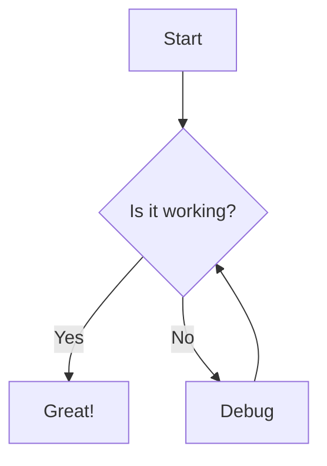

# Example Mod

This is an example mod documentation page.

## Installation

```bash
npm install example-mod
```

## Usage

```ts
import { hello } from "example-mod"

hello()
```

## Mermaid Example



## LaTeX Example

Inline: $E = mc^2$

Block:

$$
\frac{1}{2} \rho v^2 + \rho g h + p = \text{constant}
$$
