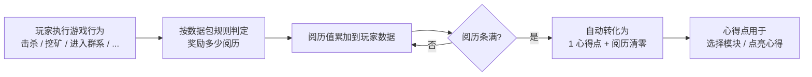

# 阅历与心得点 Aptitude & Insight Point

阅历（Aptitude）是玩家的**经验蓄水池**，心得点（Insight Point）是**可消费的技能点**。这两者共同构成「顿悟」的资源系统。

> 本页面向数据包作者，讲解阅历的来源配置与心得点的获取公式。**如何注册新的阅历行为（第三方模组扩展）在 [注册新的 Aptitude Source](Register%20New%20Aptitude%20Source.md) 章节**。

## 核心流程



## 文件位置

阅历映射的定义以「按行为分类」的数据包 JSON 形式存在:

```
data/<namespace>/epiphany/aptitude/<behavior>.json
```

- 每个文件代表**一种行为**(如 `kill_entity` / `mine_block` / `experience_level_up`)
- **行为 ID = `<namespace>:<文件名>`**(不包含父目录路径)，例：`data/mymod/epiphany/aptitude/fishing.json` → `mymod:fishing`
- **行为 ID 与监听器需求严格对应** —— 内置 13 个行为的文件名固定(见下表),其他 ID 只有当第三方模组注册了对应监听器时才生效

## 完整样例

```jsonc
{
    "default": 3,                              // 可选,默认 0
    "specials": [                              // 可选,默认空
        {
            "target": "minecraft:zombie",      // 必填,可以是 id 或 "#tag"
            "reward": 5,                       // 可选,默认回退到 default
            "first_reward": 1000               // 可选,每个玩家仅发放一次(持久化)
        },
        {
            "target": "minecraft:wither",
            "reward": 100,
            "first_reward": 500
        }
    ],
    "exclude": [                               // 可选,默认空
        "#epiphany:friendly",                  // 命中即跳过本发放
        "minecraft:villager"                   // 可以是 id 或 "#tag"
    ]
}
```

**最简形态**(只设置默认奖励):

```jsonc
{ "default": 2 }   // 例:experience_level_up.json — 每升 1 级 +2 阅历
```

## 字段说明

### `default`（可选）

- 类型：long
- 默认：`0`
- 当触发目标**不在 specials，也不在 exclude** 时发放的阅历

> 若 `default = 0` 且没有匹配的 special，该行为**不发放任何阅历**。

### `specials`（可选）

- 类型：list of `SpecialEntry`
- 默认：空
- 按 target **覆盖** default 的奖励规则

每个 `SpecialEntry` 含三个字段：

| 字段 | 类型 | 必填 | 说明 |
|------|------|:----:|------|
| `target` | String | ✅ | 目标引用，可以是 plain id（`"minecraft:zombie"`）或 tag 引用（`"#minecraft:undead"`） |
| `reward` | long（可选） | | 该 target 的奖励值；缺省时**回退到 default** |
| `first_reward` | long（可选） | | **每个玩家仅发放一次**的额外奖励，与 reward 叠加；追踪状态持久化到玩家数据 |

::: tip first_reward 用法
`first_reward` 是给"玩家首次完成某项内容"的额外奖励，典型用法：
- 首次击杀 boss：`{ "target": "minecraft:wither", "reward": 100, "first_reward": 500 }` → 玩家首次击杀 wither 获得 600（100 + 500），之后再击杀只获得 100
- 首次进入稀有群系：同理

每个玩家的"已领取列表"保存在玩家数据中，死亡 / 重生 / 维度切换都不丢失。
:::

### `exclude`（可选）

- 类型：list of String
- 默认：空
- **黑名单**：命中即**完全不发放**（跳过 specials 与 default 评估）
- 每个条目同 `target`，可以是 plain id 或 `"#tag"`

::: warning exclude 的"短路"语义
exclude 在 specials 之前**先评估**：任一 exclude 条目命中目标，整个发放**立即终止**，即使 specials 也有该 target。换言之，exclude 优先级最高。

适合场景："所有友好生物都不给阅历" `"exclude": ["#epiphany:friendly"]`，无需逐个列举。
:::

## tag 与 registry 的关系

`specials[].target` 与 `exclude[]` 都支持 `"#tag"` 形式（Minecraft 标准 tag 引用）。但要正确解析 tag，系统需要知道目标所属的注册表：

- **内置行为的 registry 已固定**（见下表）—— 数据包作者无需关心，只要正确使用 tag 命名空间即可
- **若某行为无自然注册表**(如 `experience_level_up`),则 `"#tag"` 形式**永不匹配**,会回退到 default 或不发放

## 内置行为（13 种）

以下是「顿悟」本体提供监听的 13 种行为。数据包中文件名必须与下方 ID 一致，监听器才会查找到你的配置。

### 通用行为（原版事件）

| 行为 ID | 触发条件 | target 格式 | registry | `#tag` 支持 |
|---------|---------|------------|----------|:---------:|
| `epiphany:kill_entity` | 玩家击杀实体 | entity type id（`minecraft:zombie`） | `ENTITY_TYPE` | ✅ |
| `epiphany:mine_block` | 玩家挖方块 | block id（`minecraft:diamond_ore`） | `BLOCK` | ✅ |
| `epiphany:advancement_earn` | 获得进度 | advancement id（`minecraft:end/kill_dragon`） | — | ❌ |
| `epiphany:experience_level_up` | 经验升级 | 无（占位） | — | ❌ |
| `epiphany:enter_dimension` | 维度切换 | dimension id（`minecraft:the_nether`） | — | ❌ |

::: tip experience_level_up 只用 default
`experience_level_up` 没有自然的 target（每升 1 级只是一个数字变化）。监听器对每升 1 级调用一次 `grant`，**target 用占位符**。所以数据包只需写：
```jsonc
{ "default": 2 }
```
specials 与 exclude **不生效**（target 永远是 `epiphany:_`）。
:::

### 状态追踪行为（需持久化对比）

| 行为 ID | 触发条件 | target 格式 | registry | `#tag` 支持 |
|---------|---------|------------|----------|:---------:|
| `epiphany:enter_biome` | 玩家当前所在群系变化 | biome id | `BIOME`（从 level 注册表） | ✅ |
| `epiphany:enter_structure` | 玩家所在的结构集合变化 | structure id 或 `epiphany:none`（不在任何结构内） | `STRUCTURE`（从 level 注册表） | ✅ |

::: info enter_structure 的特殊 target
若玩家**不在任何结构内**，监听器发送的 target 是 `epiphany:none`（约定的哨兵值）。所以可以通过：
```jsonc
{
    "default": 1,
    "specials": [
        { "target": "epiphany:none", "reward": 0 }  // 不在结构内时不给阅历
    ]
}
```
实现"仅结构内探索奖励"的逻辑。
:::

### Epiphany 内部行为

| 行为 ID | 触发条件 | target 格式 |
|---------|---------|------------|
| `epiphany:module_selected` | 选择模块（`ModuleSelectedEvent`） | module id |
| `epiphany:module_completed` | 完成模块（`ModuleCompletedEvent`） | module id |
| `epiphany:insight_selected` | 点亮心得（`InsightSelectedEvent`） | insight id |
| `epiphany:epiphany_selected` | 激活顿悟（`EpiphanySelectedEvent`） | epiphany id |

### FTBQ 联动（软依赖）

| 行为 ID | 触发条件 | target 格式 | 备注 |
|---------|---------|------------|------|
| `epiphany:ftbq_quest_complete` | 完成 FTB Quests 任务 | FTBQ quest hex 字符串 id | 需要在 pack 中安装 FTB Quests |
| `epiphany:ftbq_chapter_complete` | 完成 FTB Quests 章节 | FTBQ chapter hex 字符串 id | 同上 |

FTBQ 未加载时，这两类监听器**不会注册**（软依赖隔离），相关 JSON 会被忽略，不会崩溃。

## 配置

以下配置位于 `config/epiphany-common.toml`，影响所有阅历获取：

| 配置项 | 默认值 | 说明 |
|--------|:------:|------|
| `aptitudeGainMultiplier` | `1.0` | **全局倍率**，应用于所有 datapack 行为发放的阅历；`0.0` 等同关闭 datapack 来源，`2.0` 则翻倍 |
| `baseAptitudeCap` | `10` | 第一个心得点所需的阅历基础值 |
| `aptitudeCapGrowth` | `1` | 每多获得 1 心得点，所需阅历增加的量 |

::: tip 用 multiplier 做平衡
你不需要为每个 JSON 单独调整数值。如果整体节奏过快 / 过慢，直接改 `aptitudeGainMultiplier` 即可全局缩放，不影响数据包内的相对比例。
:::

## 阅历 → 心得点公式

阅历条满后自动转化为 1 心得点，阅历清零。**所需阅历随玩家已累计获得的心得点数递增**：

$$

\text{所需阅历} = \text{baseAptitude\_Cap} + (\text{totalSpent} + \text{insightPoints}) \times \text{aptitudeCapGrowth}

$$

其中：
- `totalSpent` = 玩家历史累计已花费的心得点
- `insightPoints` = 玩家当前可用未花费的心得点
- 两者之和 = **累计获得过**的心得点总数 = 升级档位

### 默认公式示例（`baseAptitudeCap=10`、`aptitudeCapGrowth=1`）

| 累计心得点 | 距离下一心得点所需阅历 |
|:---:|:---:|
| 0 | 10 |
| 1 | 11 |
| 2 | 12 |
| 5 | 15 |
| 10 | 20 |
| 50 | 60 |

调整两个 config 参数可控制节奏：
- 增大 `baseAptitudeCap` → **开局更慢**（拉长前期）
- 增大 `aptitudeCapGrowth` → **后期陡峭**（拉开深度）
- 同时增大两者 → 全程都需要大量阅历

## 心得点的去向

心得点离开阅历系统后有两个消耗方向，均由系统统一处理：

| 消耗场景 | 消耗量 | 影响字段 |
|---------|--------|---------|
| 选择模块 | `Config.moduleSelectCost`（默认 1） | `insightPoints--`，`totalInsightPointsSpent++` |
| 点亮心得 | 单个心得的 `cost` 字段（默认 1） | 同上 |

## 下一步

- 想了解玩家如何获得 / 消费心得点 → [机制详解](../Players/Gameplay.md)
- 想从 Java 代码发放阅历 → [Manager API](Manager%20API.md#AptitudeManager) / [AptitudeSourceManager](Manager%20API.md#AptitudeSourceManager--AptitudeSourceResolver)
- 想注册新的阅历行为（第三方扩展）→ [注册新的 Aptitude Source](Register%20New%20Aptitude%20Source.md)
