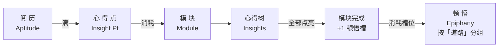

# 顿悟 Epiphany - 模块化技能树

> 
夫尽小者大，积微者著。  

> 
——《荀子·大略》

「**顿悟 Epiphany**」受到经典科幻策略游戏《群星》传统机制的启发，为 Minecraft 添加了一套数据驱动的**模块化技能树**系统。玩家将会从众多独立的**模块**中自由组合，积累**阅历**、点亮**心得**、选择**顿悟**，构建属于自己的成长路线。

「顿悟 Epiphany」是面向开发者的 API 模组，本身不包含任何实质性的技能树内容或属性修改。模组旨在为整合包与模组作者提供一套高自由度的角色构筑系统，具体的玩法与内容需要整合包自定义或使用相关数据包与模组。

模组依赖 **LDLib** ！

## 核心特色
- **模块化角色构筑**：告别传统的庞大繁杂的技能树。玩家可以自由搭配挑选，实现独一无二的自定义成长路线。
- **完全数据驱动**：所有的模块、心得、顿悟以及道路均通过数据包进行定义。无需编写任何 Java 代码，即可创造一套庞大的RPG技能体系。
- **强大且丰富的内置预设**：模组内置了丰富的条件判断与奖励机制，开箱即用
	1. **30**+ 种条件类型：支持动态判断玩家属性，所处结构，统计数据等内容，自动解锁模块与顿悟。包含逻辑运算符和关系运算符，支持复杂的判断。
	2. **14**+ 种奖励类型：包括原版属性修改、执行命令、给予物品、生物效果等诸多奖励类型
	3. **12**+ 种阅历获取途径：挖掘方块、浏览群系、击杀生物……均可获得阅历——更关键的是：阅历的获取支持完全自定义！
- **高度可配置性**：通过 Config，作者可以轻松调整阅历升级公式、玩家槽位上限、经验获取倍率与消息提示，完美融入整合包的数值节奏
- **强大的兼容性与模组支持**：联动 FTBQ、KubeJS 等主流整合包开发模组，为诸多模组新增了条件类型与奖励类型。提供开放的API、自定义事件，并支持通过 KubeJS 脚本调用事件与API
- **完善的 GUI 效果**：借助 LDLib 模组，「顿悟 Epiphany」拥有精心打磨的 UI 视觉效果，支持顺滑的节点连线，节点树拖动与动态调整，给玩家带来完善的界面体验。

由于模组目前仍处于快速迭代阶段，API 可能会有较为频繁的优化变动，但我们会尽可能保障旧版本数据包的平稳向下兼容。欢迎各位交流与反馈！

- [Github](https://github.com/HaooooZhang/Epiphany)
- [Discord](https://discord.gg/xSEWpdae9C)

## 模组架构：
- 模块：模块是独立、完整的技能树单元。开发者可以设置选择消耗心得点、选择模块上限等诸多内容。
- 心得：心得是模块内的具体升级节点，是模组最小的单元。其效果偏向于量变，例如数值与属性的微调。在一个模块里的心得根据层级深度自动组成树状结构，只有心得的所有父节点均已点亮才能选择。
- 顿悟：当玩家完全点亮一个模块内的所有心得后，该模块即宣告完成，并自动为玩家提供 1 个顿悟槽。玩家可以使用该槽位，自由选择激活一个顿悟。顿悟的效果偏向于质变。开发者可以设置玩家顿悟槽上限。
- 道路：可选的分类标签，用于分类顿悟。未指定道路的顿悟将被归入默认分组。
- 阅历：玩家的经验蓄水池，通过在游戏里执行数据包规定的行为获取。升级所需阅历的计算公式可以在配置文件中配置。
- 心得点：阅历条每充满一次，自动转化为 1 点心得点。玩家消耗心得点选择心得与模块。

## 玩家流程图

## 进阶开发与未来计划
想要实现更多超越预设的功能？本模组提供了完备的扩展渠道：
- 丰富的自定义事件与 API
- 支持使用 KubeJS 脚本调用事件与管理数据
- 条件类型、奖励类型与阅历获取均通过注册表注册，欢迎开发者基于本模组开发更高级的玩法附属
此外，作者目前正在计划制作一套联动更多主流模组的附加包，用以兼容更多主流模组的数据与行为逻辑，敬请期待！

## AI内容披露

模组开发过程中，大量使用了人工智能工具来执行批量化的编码工作以极大提高开发效率，但本模组的核心底层逻辑、框架架构设计、UI 交互体验以及产品细节均由人类作者完全主导制作，AI 仅提供辅助功能