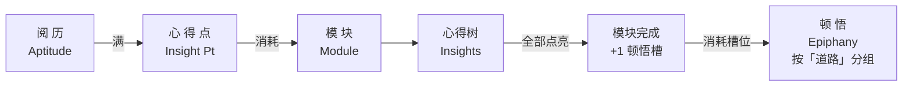
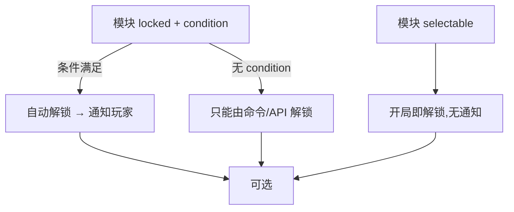
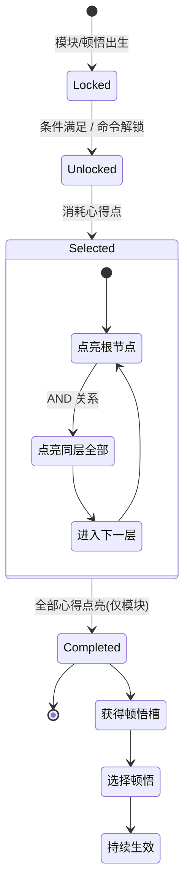

# 核心机制

> 本页深入讲解「顿悟 Epiphany」中六大核心概念的**玩家视角**运作机制。开发者视角的字段定义请见 [For Developers](../Developers/Quick%20Start.md) 章节。

## 概念总览

| 概念 | 英文 | 一句话定位 |
|------|------|-----------|
| 模块 | Module | 独立完整的技能树单元 |
| 心得 | Insight | 模块内的量变升级节点 |
| 顿悟 | Epiphany | 完成模块后的质变能力 |
| 道路 | Path | 顿悟的分类标签 |
| 阅历 | Aptitude | 经验蓄水池，满则转化 |
| 心得点 | Insight Point | 用于消费的"技能点" |

## 1. 阅历(Aptitude)

阅历是玩家的**经验蓄水池**。

### 1.1 获取

阅历的获取规则**完全由数据包定义**,整合包作者通过 JSON 决定:

- 哪些行为奖励阅历(内置击杀、挖矿、进入群系、获得成就等十余种内置行为)
- 每个目标的奖励数值
- 是否对每个玩家首杀/首次完成额外奖励
- 哪些目标不奖励(排除列表)
- 全局奖励倍率(`aptitudeGainMultiplier` 配置项)

> 「顿悟」本体不预设任何行为奖励——你能否通过挖矿、击杀获取阅历，取决于整合包。

### 1.2 升级公式
阅历条满后会自动转化为 1 点心得点，阅历清零。**所需阅历随已累计获得的心得点数递增**：

$$

\text{所需阅历} = \text{baseAptitudeCap} + (\text{totalSpent} + \text{insightPoints}) \times \text{aptitudeCapGrowth}

$$

**默认数值举例**（`baseAptitudeCap = 10`，`aptitudeCapGrowth = 1`）：

| 已获心得点数 | 距离下一心得点所需阅历 |
|:---:|:---:|
| 0 | 10 |
| 1 | 11 |
| 2 | 12 |
| 5 | 15 |
| 10 | 20 |

两项参数均可在 Config 中调整，整合包可借此控制游戏的早/后期节奏。

### 1.3 特点

- 阅历有**上限**（由配置控制），不会无限累积
- 阅历在死亡时**保留**
- 阅历不会"部分转化"——必须累积到上限才会获得完整 1 点心得点
- 心得点**无上限**，可一直累积

## 2. 心得点（Insight Point）

心得点是用于消费的"技能点"。

### 2.1 获取途径

| 途径 | 说明 |
|------|------|
| 阅历条满 | 自动 +1 |
| 命令 | `/epiphany insight points add <player> <数量>` |
| 奖励链 | 数据包中某些奖励类型可直接给予心得点 |

### 2.2 消耗场景

| 场景 | 默认消耗 | 备注 |
|------|:---:|------|
| 选择模块 | `moduleSelectCost = 1` | 所有模块统一消耗，不可单模块自定义 |
| 点亮心得 | 心得 JSON 的 `cost` 字段（默认 1） | 每个心得可独立设定 |

### 2.3 特点

- 无上限
- 死亡保留
- 不可被玩家主动丢弃或交易

## 3. 模块（Module）

模块是**独立、完整**的技能树单元。

### 3.1 初始状态

模块有 **两种初始状态**，决定其初始的可见性与可选择性：

| 状态 | 含义 |
|------|------|
| **`locked`（锁定）** | 玩家初始看不到/选不了。若模块定义了 `condition`，条件满足后会自动解锁并弹通知；若**未定义** condition，则只能通过管理员命令 / API 解锁 |
| **`selectable`（可选）** | 玩家开局即可见且可选。通常这类模块不设 condition |

### 3.2 解锁流程

### 3.3 选择

- 选择模块统一消耗 `moduleSelectCost` 心得点（默认 1）
- 同时选中模块数量有上限 `maxSelectedModules`（默认 8）
- 选择后模块的 `on_select_reward` 立即生效；该奖励可以是物品、属性、命令、效果等

> 💡 选择模块是一个 **Pre 事件可取消** 的时机点。整合包作者可以通过 KubeJS 监听拦截。

### 3.4 完成

当模块内**所有心得**全部点亮，模块自动**完成**：

1. 触发 `on_complete_reward`（若定义）
2. **+1 顿悟槽**
3. Post 通知事件

模块完成本身不可手动取消判定——只要点亮了所有心得就会触发。但 Pre 事件允许第三方拦截后**留待重新触发**（此时不加槽位、不发放奖励，模块保持未完成）。

### 3.5 重置

- 玩家**无法撤销**模块选择
- 管理员可用:
  - `/epiphany module reset <玩家> <模块id>` — 重置单个模块（退回未选状态）
  - `/epiphany reset select <玩家>` — 全清所有选择（退还心得点）
  - `/epiphany reset all <玩家>` — 完全重置（阅历也清零）

## 4. 心得(Insight)与心得树

心得是模块内的**量变**升级节点。

### 4.1 树形结构(depth)

模块通过 JSON 中的 `insights` 列表定义心得树，每个心得条目带一个 **`depth`（层级深度）** 字段：

- **`depth = 0`** → 根节点（最顶层）
- **`depth = N`** → 其父节点是数组中最近且存在的 `depth = N-1` 心得
- **同一 `depth` 的多个心得** → **AND 关系**：必须**全部点亮**才能解锁下一层

**示意：**

（插入一张图片）

### 4.2 点亮前置

要点亮某个心得，必须**同时满足**：

1. 所属模块**已被选中**
2. 该心得在**同一层**及更浅层的所有**必经心得**均已点亮
3. 心得点足够支付 `cost`

### 4.3 特点

- 心得 JSON 中的 `cost` 默认为 1，可独立设定
- 心得奖励偏向量变：小幅属性加成、效果、物品等
- 点亮**不可撤销**（玩家侧），只能管理员命令 `/epiphany insight reset`
- 心得奖励若是"持久型"（如属性修改），死亡 / 切换维度后会自动重新应用

## 5. 顿悟（Epiphany）

顿悟是**质变级**的能力奖励。

### 5.1 解锁与选择

- 顿悟存在于**全局池**，与具体模块**解耦**
- 顿悟也有 `locked` / `selectable` 两种初始状态，语义和模块相同
- 玩家需消耗**顿悟槽**才能激活一个顿悟

### 5.2 顿悟槽

| 规则 | 说明 |
|------|------|
| 获取 | 每完成 1 个模块 +1 槽位 |
| 上限 | `maxEpiphanySlots`（默认 8） |
| 用途 | 占用 1 个槽位激活 1 个顿悟 |
| 释放 | 重置该顿悟后槽位空出 |

> ⚠️ 完成模块超出槽位上限时，虽然仍会记录"已完成"，但**不会发放额外有效槽位**。玩家需要重置旧顿悟来腾位置。

### 5.3 道路（Path）分组

- 顿悟可通过 `path` 字段指定一条**道路**，道路在 UI 中用于**分页/分组显示**
- 关系是**单向**的：顿悟 → 道路；道路本身不持有顿悟列表
- 未指定 `path` 的顿悟归入**默认组**
- 道路仅作展示用，不影响游戏逻辑

### 5.4 特点

- 顿悟效果偏向质变:新机制、强力被动、改变规则
- 持久型顿悟奖励在死亡 / 切换维度后自动重新生效
- 顿悟不可单点撤销,只能 `/epiphany epiphany reset <玩家> <顿悟id>`

## 6. 道路（Path）

道路是顿悟的**分类标签**，本身无游戏效果。

- 可选:顿悟可不指定
- 单向:Epiphany → Path
- UI:按道路分页展示顿悟
- 默认组:无 `path` 字段的顿悟自动归入

## 7. 事件与通知

### 7.1 玩家可见的通知

「顿悟」在以下事件触发时会向玩家发送 **聊天消息 + 音效**（临时方案，未来会改为 Toast）：

| 通知开关 | 触发时机 |
|----------|---------|
| `notifyInsightPoints` | 获得心得点时（满级转化、命令发放、奖励给予） |
| `notifyModuleUnlock` | locked 且有 condition 的模块条件满足自动解锁时。**`selectable` 模块不通知** |
| `notifyEpiphanyUnlock` | locked 且有 condition 的顿悟自动解锁时。**`selectable` 顿悟不通知** |

这些通知可在 Config 中独立开关。

### 7.2 死亡 / 维度切换的奖励保留

- 所有数据(阅历、心得点、模块进度、顿悟选择)**死亡保留**
- 标记为 **`PersistentReward`** 的奖励（目前包括属性修改、效果、解锁/锁定模块 / 顿悟等）会在**玩家重生**和**维度穿越**后自动**重新应用**
- 瞬时奖励(物品发放、命令执行、经验、粒子)不会重新触发

## 8. 完整生命周期图

## 下一步

- [Config 配置参考](Config.md) — 所有可调参数
- [Command 命令参考](Command.md) — `/epiphany` 命令树
- [For Developers](../Developers/Quick%20Start.md) — 自定义技能树与扩展开发
